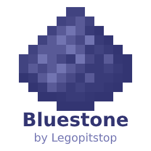

# [<](../README.md) Bluestone

Bluestone? Bluestone adds one block component to make your Redstone small and easy!

## Pack Data

| Key                | Value                                                                                                 |
| ------------------ | ----------------------------------------------------------------------------------------------------- |
| supported          | `no`                                                                                                  |
| namespace          | `bluestone`                                                                                           |
| pack_version       | `beta`                                                                                                |
| mc_version         | `1.16.5`                                                                                              |
| multiplayer_tested | `no`                                                                                                  |
| has_config         | `no`                                                                                                  |
| dependency         | [LPS Rcore API](https://www.curseforge.com/minecraft/customization/legopitstops-recipe-core-datapack) |

## LINKS

- [Download](https://www.curseforge.com/minecraft/customization/bluestone-datapack)
- [Wiki Page](https://github.com/legopitstop/Datapacks/wiki)
- [License](https://legopitstop.weebly.com/legopitstops-common-license-v2.html)
- [Bug Report](https://github.com/legopitstop/Datapacks/issues)
