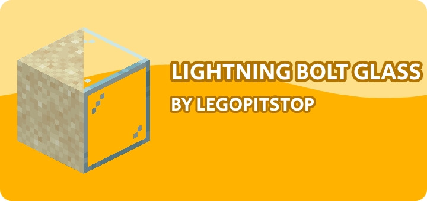

# [<](../README.md) Lightning Bolt Glass

Whenever lightning hits sand it turns into a glass

## Pack Data

| Key                | Value       |
| ------------------ | ----------- |
| supported          | `yes`       |
| namespace          | `lightning` |
| pack_version       | `1.0.0`     |
| mc_version         | `1.16.5`    |
| multiplayer_tested | `no`        |
| has_config         | `no`        |

## LINKS

- [Download](https://www.curseforge.com/minecraft/customization/lightning-bolt-glass-datapack)
- [Wiki Page](https://github.com/legopitstop/Datapacks/wiki)
- [License](https://legopitstop.weebly.com/legopitstops-common-license-v2.html)
- [Bug Report](https://github.com/legopitstop/Datapacks/issues)
