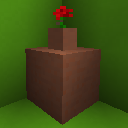

# [<](../README.md) More Flower Pots

This data pack adds 33+ flower pot colors to your world. These flower pots can be crafted (Using the required API). What are you waiting for? Go and check it out! Make sure to install the Recipe API to craft all these new flower pots in survival.

## Pack Data

| Key                | Value                                                                                                 |
| ------------------ | ----------------------------------------------------------------------------------------------------- |
| supported          | `yes`                                                                                                 |
| namespace          | `morepots`                                                                                            |
| pack_version       | `1.0.0 `                                                                                              |
| mc_version         | `1.17`                                                                                                |
| multiplayer_tested | `no`                                                                                                  |
| has_config         | `no`                                                                                                  |
| dependency         | [LPS Rcore API](https://www.curseforge.com/minecraft/customization/legopitstops-recipe-core-datapack) |

## LINKS

- [Download](https://www.curseforge.com/minecraft/customization/more-flower-pots)
- [Wiki Page](https://github.com/legopitstop/Datapacks/wiki/More_Flower_Pots)
- [License](https://legopitstop.weebly.com/legopitstops-common-license-v2.html)
- [Bug Report](https://github.com/legopitstop/Datapacks/issues)
