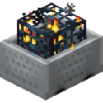

# [<](../README.md) Moveable Tiles

Moveable Spawners, Chests, Barrels and More!

## Pack Data

| Key                | Value      |
| ------------------ | ---------- |
| supported          | `yes`      |
| namespace          | `moveable` |
| pack_version       | `beta `    |
| mc_version         | `1.19.3`   |
| multiplayer_tested | `no`       |
| has_config         | `no`       |

## LINKS

-   [Download](DOWNLOAD)
-   [Wiki Page](https://github.com/legopitstop/Datapacks/wiki/Moveable_Tiles)
-   [License](https://legopitstop.weebly.com/license.html)
-   [Bug Report](https://github.com/legopitstop/Datapacks/issues)
