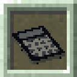

# [<](../README.md) Simple Calculator

Is math too hard? don't know what 1+1 is? This pack adds a calculator!

## Pack Data

| Key                | Value        |
| ------------------ | ------------ |
| supported          | `yes`        |
| namespace          | `calculator` |
| pack_version       | `1.3.0`      |
| mc_version         | `1.16.5`     |
| multiplayer_tested | `no`         |
| has_config         | `no`         |

## LINKS

- [Download](https://www.curseforge.com/minecraft/customization/simple-calculator-datapack)
- [Wiki Page](https://github.com/legopitstop/Datapacks/wiki)
- [License](https://legopitstop.weebly.com/legopitstops-common-license-v2.html)
- [Bug Report](https://github.com/legopitstop/Datapacks/issues)
