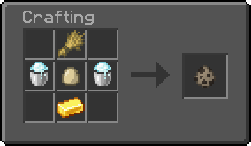
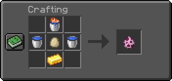
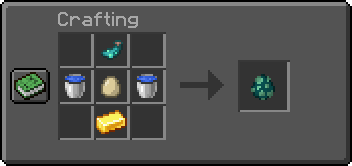

# CHANGELOG v1.7.0
## General
- Added datapack registering system that is common for all legopitstop's datapacks
- Settings are now saved via storage instead of score
- Use `function spawnercraft:config` for config menu.
- To craft the custom spawn eggs the setting in the config needs to be set to true, it is set to false by default.
- Drop all the items on a crafting table to craft the custom spawn eggs. (look below to change crafting blocks)
- Removed air from recipes, this is auto generated, and is unneeded.
- Drop recipes will now spawn the item instead of giving the item.
- If you have custom spawn eggs toggled off it will not show the recipes via the info trigger.
- Custom spawn eggs now have custom id's for other packs to use. This however means you cannot make the derpy snow golem from old snow golem spawn eggs.
- Added warning message for 1.16.x users that will notify you of bug [MC-189565](https://bugs.mojang.com/browse/MC-189565)
- If you create one of the spawners from [MC-189565](https://bugs.mojang.com/browse/MC-189565) it will remove it when you are playing in 1.16, It will not for 1.17 as this bug has been fixed.
- Note that their is a bug that recipes that use the Powder Snow Bucket does not give a bucket back. [MC-151457](https://bugs.mojang.com/browse/MC-151457)
## New Recipes for 1.17
These recipes are subject to change, (The Goat and Axolotl don't have any drops so..)
- Goat 

- Axolotl

- Glow Squid

## Fixes
- Info trigger should now work in muliplayer

## Customize your datapack
- Keep in mind of the LICENSE.md before editing the datapack files.
- You can use the built-in UI to enable/disable the custom spawn egg recipes.
- Block tags. located: `datapack/data/spawnercraft/tags/blocks/<here>`
    - `spawnercraft:crafting_blocks` (default: crafting table) All the blocks that you can drop craft the custom spawn eggs onto.

- Item tags. Item tags contain common items that are used inside the recipes. located: `datapack/data/spawnercraft/tags/items/<here>`
    - `spawnercraft:cost_items` (default items: gold_ingot) The cost item used in all recipes.
    - `spawnercraft:egg_items` (default items: egg) The egg item used in all the recipes.
    - `spawnercraft:spawner/bottom_items` (default items: obsidian) The item that is at the bottom of the spawner recipe.
    - `spawnercraft:spawner/cost_items` (default items: diamond block) The item that is in the center of the spawner recipe.
    - `spawnercraft:spawner/outside_items` (default items: iron bars) The item that is around the other items in a up-side-down `U` shape for the spawner