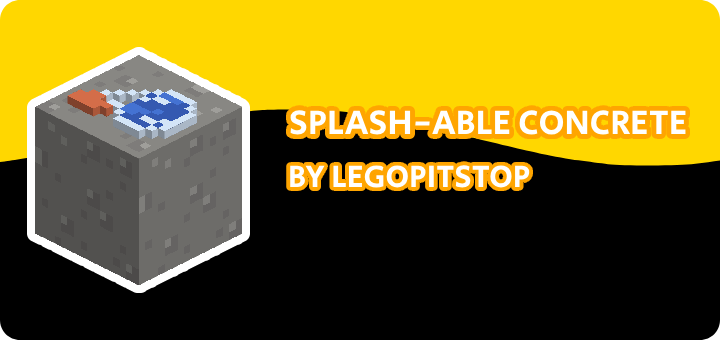

# [<](../README.md) Splashable Concrete

Convert concrete powder to hardened concrete using water bottles and more!

## Pack Data

| Key                | Value            |
| ------------------ | ---------------- |
| supported          | `yes`            |
| namespace          | `splashconcrete` |
| pack_version       | `1.0.0`          |
| mc_version         | `1.16.5`         |
| multiplayer_tested | `no`             |
| has_config         | `no`             |

## LINKS

- [Download](https://www.curseforge.com/minecraft/customization/splash-able-concrete-datapack)
- [Wiki Page](https://github.com/legopitstop/Datapacks/wiki)
- [License](https://legopitstop.weebly.com/legopitstops-common-license-v2.html)
- [Bug Report](https://github.com/legopitstop/Datapacks/issues)
