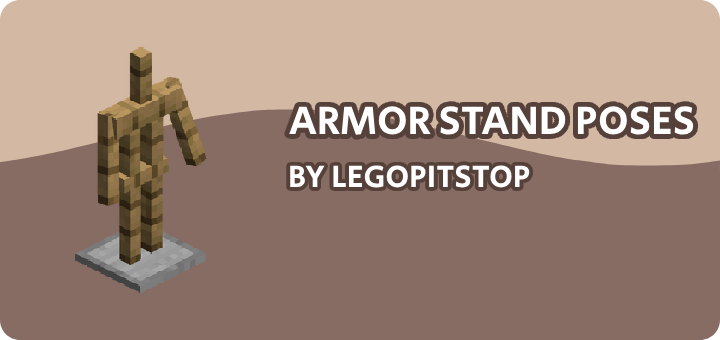

# [<](../README.md) ARMORSTAND POSES

Bedrock armor stand poses for Java Edition

## Pack Data

| Key                | Value   |
| ------------------ | ------- |
| supported          | `yes`   |
| namespace          | `poses` |
| pack_version       | `1.5.0` |
| mc_version         | `1.21`  |
| multiplayer_tested | `no`    |
| has_config         | `no`    |

## LINKS

- [Download](https://www.curseforge.com/minecraft/customization/armor-stand-poses-datapack)
- [Wiki Page](https://github.com/legopitstop/Datapacks/wiki)
- [License](https://license.lpsmods.dev)
- [Bug Report](https://github.com/legopitstop/Datapacks/issues)
