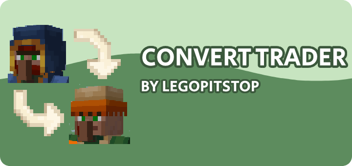

# [<](../README.md) Convert Traders

Easily convert Wandering Traders to normal Villagers!

## Pack Data

| Key                | Value    |
| ------------------ | -------- |
| supported          | `yes`    |
| namespace          | `trader` |
| pack_version       | `1.2.0`  |
| mc_version         | `1.18.1` |
| multiplayer_tested | `yes`    |
| has_config         | `yes`    |

## LINKS

- [Download](https://www.curseforge.com/minecraft/customization/convert-traders-datapack-edition)
- [Wiki Page](https://github.com/legopitstop/Datapacks/wiki)
- [License](https://license.lpsmods.dev)
- [Bug Report](https://github.com/legopitstop/Datapacks/issues)
